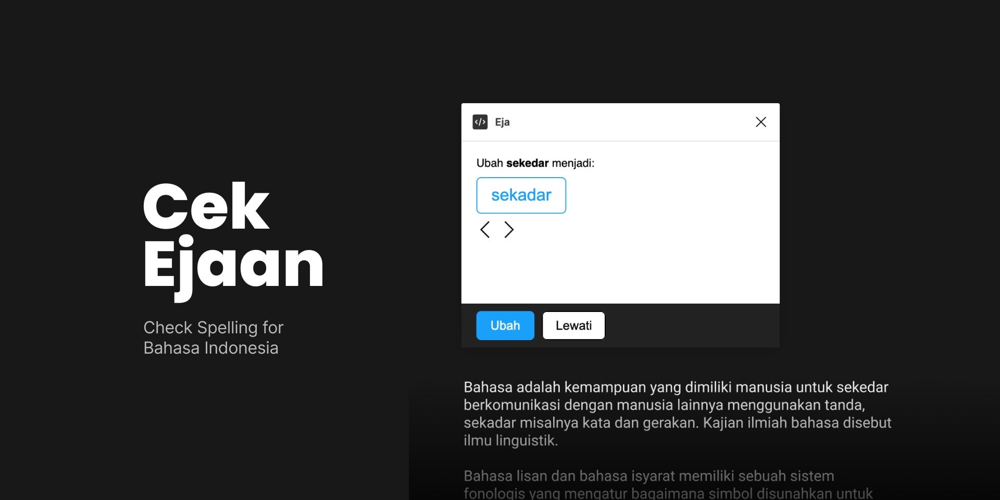

# Cek Ejaan Figma Plugin

Spell Checking for Bahasa Indonesia. This makes it easy to check the typo or spelling mistakes in your design.

[Install Figma Plugin](https://www.figma.com/community/plugin/1013364535408157858/Cek-Ejaan)

# Data Source

All the data/words are taken from https://kbbi.vercel.app/ credits to [@mathdroid](https://github.com/mathdroid/)

# Getting Started

To use:

    $ yarn
    $ yarn start
    $ yarn lint
    $ yarn build
